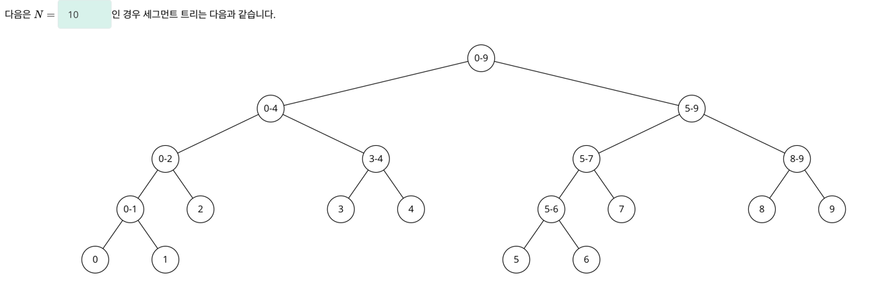
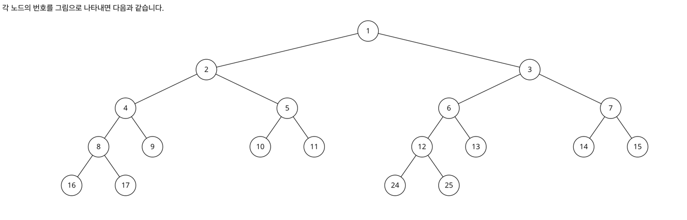

# 구간 합 구하기
https://www.acmicpc.net/problem/2042

입력
```text
5 2 2
1
2
3
4
5
1 3 6
2 2 5
1 5 2
2 3 5
```
출력
```text
17
12
```

## 세그먼트 트리!


출처: 
1. N개의 숫자에 대한 세그먼트 트리는 0~N-1 인덱스로 나눠서 봤을 때 높이가 logN/log2가 된다.
2. 높이가 h인 트리에 대한 배열은 2^(h+1)의 길이로서 표현이 가능하다.
3. `init()`
   - 세그먼트 트리를 세팅할 때는 start와 end가 같아질 때까지 좌우 자식 노드로 탐색해가면서 같아지는 순간 해당 인덱스(start 혹은 end)의 값을 트리에 넣어준다.
   - 참고로 자식 노드는 좌: 현재 노드 * 2, 우: 현재 노드 * 2 + 1이다.
4. `query()`
   - 찾고자 하는 범위는 `left`  ~ `right`다.
     - 참고로 left와 right는 인덱스가 아니므로 -1을 해준 값을 파라미터로 전달해야한다.
   - `left`와 `right`가 이미 `start`와 `end` 범위 외라면 0을 반환한다.
   - `left`와 `right`가 `start`와 `end`에 완전히 겹친다면 더 탐색할 필요없이 해당 노드(그 구간의 합)을 바로 반환한다.
   - 걸쳐져 있는 경우에는 분할 탐색을 하여 바로 위 조건이 될 때까지 탐색을 한다.
     - 그리고 분할탐색 결과 반환된 값들을 합하여 반환한다.
5. `update()`
   - 이 문제의 경우 `index`도 (index+1) 번째 숫자를 의미하므로 입력받은 값에서 -1을 해주고 파라미터로 전달해야 맞다.
   - `index`가 start와 end범위 외라면 바로 재귀호출을 종료한다.
   - 위의 종료 조건을 거쳤음에도 `start`와 `end`가 같아지는 순간이 온다면 그 때가 update 시점이다.
     - `a[]` 배열과 `tree[]` 배열을 이때 모두 업데이트시켜준다.
   - 그 외에는 계속 분할탐색을 시켜주고, 업데이트됨에 따라 부모노드들도 업데이트돼야하기 때문에 계속 업데이트시켜준다.
